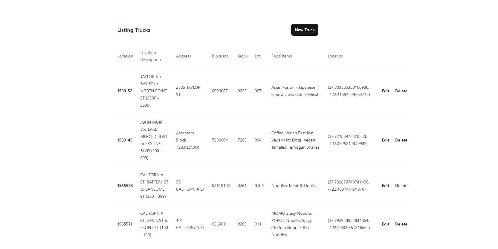
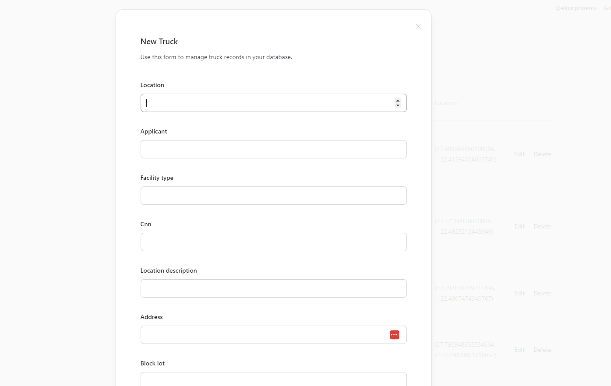
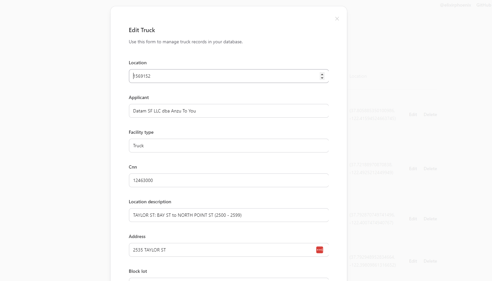

# TrevikPetersonPeckAssessment
 authored by Trevik Peterson
This is to be used as a admin tool for managing database.

 To start your Phoenix server:

  * Run `mix setup` to install and setup dependencies
  * Start Phoenix endpoint with `mix phx.server` or inside IEx with `iex -S mix phx.server`

* if data is not already seeded run `mix run .\priv\repo\seeds.exs`

Now you can visit [`localhost:4000`](http://localhost:4000) from your browser.

Ready to run in production? Please [check our deployment guides](https://hexdocs.pm/phoenix/deployment.html).